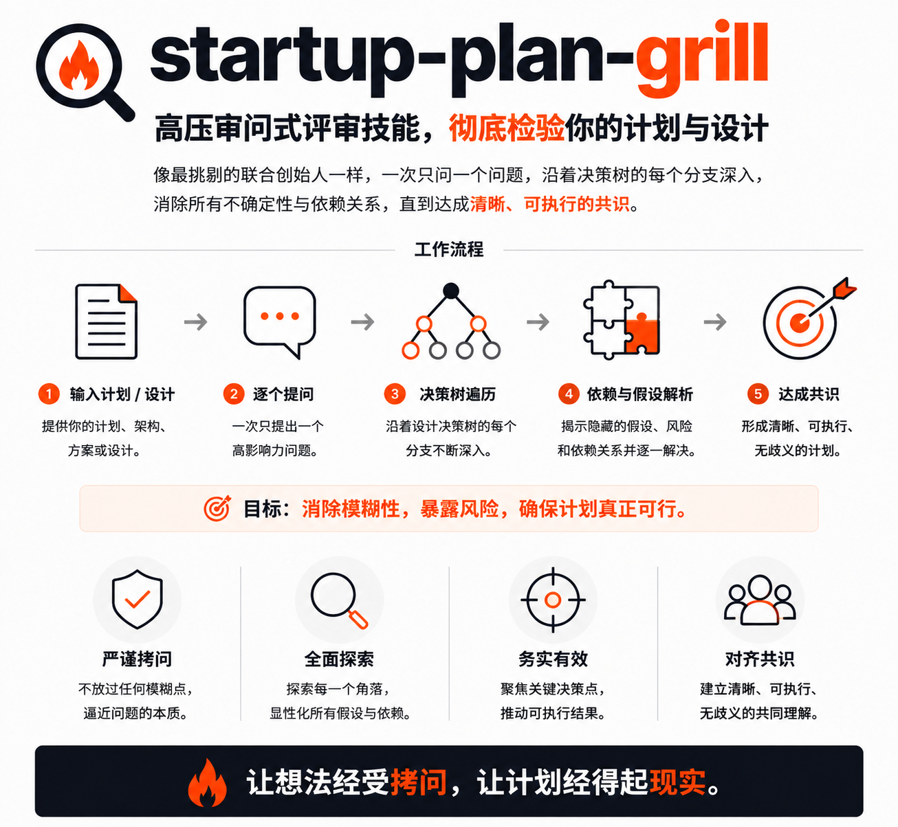

# startup-plan-grill

苏格拉底式创业计划书打磨技能。不讲课，不判断好坏，只发问。通过 6 个阶段、127 道问题，帮创业者把想法变成 10 章创业计划书。



## 原理

7 本创业书的核心框架，按"先判断方向 → 再评估机会 → 设计模式 → 验证假设 → 搭建引擎 → 规划财务"的递进逻辑组织：

| 阶段 | 核心框架 | 题目数 |
|------|---------|--------|
| 0 战略定位 | 从0到1 (Zero to One) | 15+3 |
| 1 机会评估 | 如何测试商业模式 (Testing Business Models) | 23 |
| 2 商业模式设计 | 商业模式新生代 (Business Model Generation) | 19 |
| 3 精益验证 | 精益创业 (The Lean Startup) | 19 |
| 4 引擎与组织 | 从0到1 + 精益创业 + 精益创业2.0 | 29 |
| 5 财务与融资 | 一本书读懂财报 + 风险投资交易 (Venture Deals) | 22+6 |

不提供口嗨型鼓励和空洞评价。只输出三样东西：追问、矛盾、红色警报。

## 文件结构

```
startup-plan-grill/
├── SKILL.md            # 技能入口，agent 加载后读取
├── REFERENCE.md        # 统一参考文档（127 题 + 分支逻辑 + 执行协议 + 检查点 + 输出模板）
├── EXAMPLES.md         # 入门指南与完整实战对话
├── examples/           # 6 个阶段示例对话（以校园二手教材 C2C 平台为贯穿案例）
│   ├── Stage-0.md
│   ├── Stage-1.md
│   ├── Stage-2.md
│   ├── Stage-3.md
│   ├── Stage-4.md
│   └── Stage-5.md
├── README.md           # 本文件
└── docs/               # 设计文档与实施计划
```

## 使用方式

### 触发方式

本技能兼容任何 AI 编码 agent（OpenCode、Claude Code、Codex、Cline 等）。当用户说出以下触发词时，agent 应加载本技能并进入 6 阶段流程：

> "grill me" / "创业" / "商业计划书" / "创业计划书" / "打磨我的创业想法"

### 斜杠命令

| 命令 | 别名（自然语言） | 效果 |
|------|-----------------|------|
| `/grill-me` | "grill me" / "创业" / "商业计划书" | 启动一轮完整的创业计划书打磨流程，从 Stage 0 开始 |
| `/skip Y` | "跳过Y阶段" | 跳过 Y 阶段（如 `/skip 3`），标记为【已跳过】 |
| `/redo X` | "重新回答X阶段" | 重新回答 X 阶段（如 `/redo 2`），清空答案从头追问 |
| `/draft` | "给我看目前的计划书草稿" | 查看当前计划书草稿 |
| `/consult` | "这部分专业性较强" | 针对财务、融资等专业领域，建议咨询专业顾问 |

### 启动对话

在 agent 加载本技能后，第一句话永远是：

```
用一句话描述你的创业想法：你为谁解决了什么问题？
```

### 运行流程

1. Agent 每次只问一道题，从 REFERENCE.md 原文读取
2. 用户回答后，按 REFERENCE.md 中的 4 级追问力度处理（温和探询 → 聚焦追问 → 挑战检验 → 红色警报）
3. 答案直接记入计划书草稿，阶段结束生成结构化输出
4. 所有阶段完成后，输出 10 章创业计划书

## 实战对话示例

[`EXAMPLES.md`](EXAMPLES.md) 包含一段完整的 6 阶段打磨对话，以校园二手教材 C2C 平台为贯穿案例。`examples/` 目录下按阶段拆分为独立文件：

- [`examples/Stage-0.md`](examples/Stage-0.md) — 战略定位（Z2O 框架）
- [`examples/Stage-1.md`](examples/Stage-1.md) — 机会评估（TBM 7 领域）
- [`examples/Stage-2.md`](examples/Stage-2.md) — 商业模式设计（BMG 画布）
- [`examples/Stage-3.md`](examples/Stage-3.md) — 精益验证（LS 创新核算）
- [`examples/Stage-4.md`](examples/Stage-4.md) — 引擎与组织（增长 + 团队 + LS2）
- [`examples/Stage-5.md`](examples/Stage-5.md) — 财务与融资

对话开头：

> **Agent**：用一句话描述你的创业想法：你为谁解决了什么问题？
>
> **用户**：我做了一个校园二手教材 C2C 平台，专门帮大学生买卖二手教材。帮他们解决每学期教材费太贵、用一学期就闲置的问题。
>
> **Agent**：客户和问题都明确了。我想确认两点。你说的"大学生"具体是指什么群体？大一新生还是大二大三的老生？另外，"教材费太贵"这个问题你现在有数据支撑吗，还是你观察到的一个现象？

699 行完整对话涵盖全部 6 个阶段，包含 agent 的追问策略和 🔍 旁白注解。初次使用前建议通读一遍，了解 agent 的提问节奏和力度切换。

## 核心设计原则

- **不对用户想法做好/坏判断**：只指出逻辑矛盾，不下价值结论
- **问题全部来自 7 本书**：agent 不发明题目，不偏离框架
- **跨阶段一致性**：进入新阶段时自动检查与之前答案的冲突
- **适可而止**：追问不超过一个回合，用户答不出就标记并继续

## 输出

最终交付：一份 10 章创业计划书 `.md` 文件，覆盖客户与问题、市场分析与机会、商业模式、验证计划、增长引擎、团队、财务预测、融资策略等章节。
